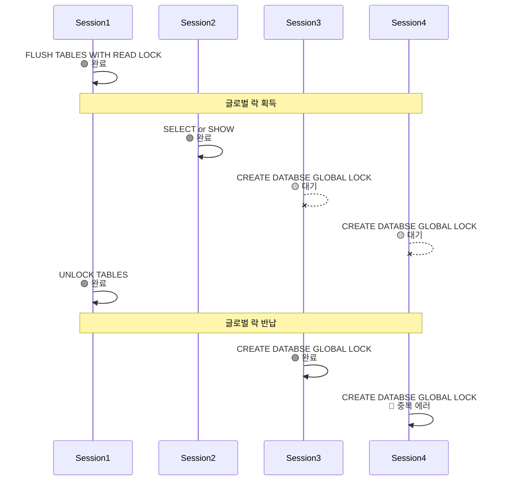
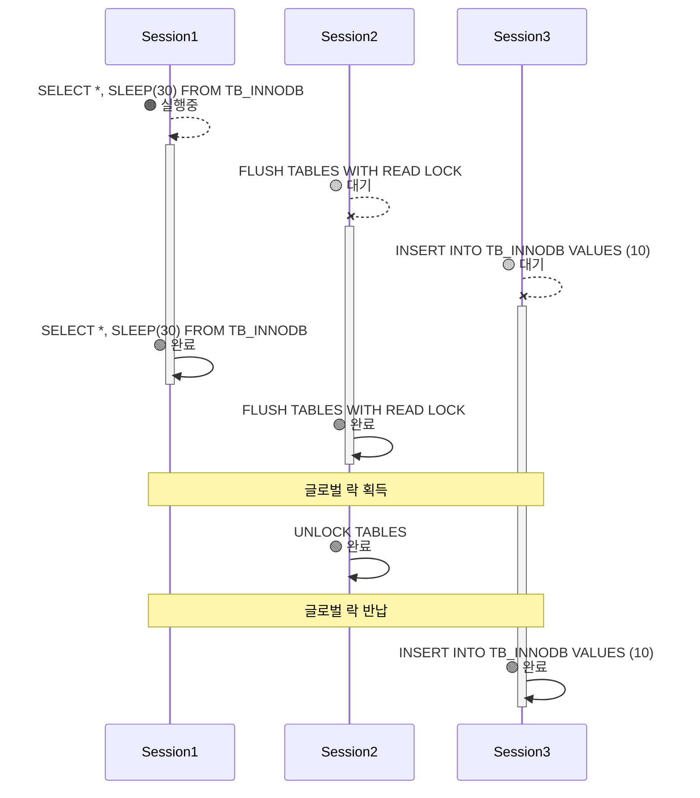

# 🎯 Global Lock

MySQL에서의 락은 크게 MySQL 엔진 레벨과 스토리지 엔진 레벨로 나눌 수 있다.  
MySQL 엔진은 스토리지 엔진을 제외한 나머지 부분에 영향을 준다.  
각 스토리지 엔진 레벨의 잠금은 스토리지 엔진간 상호 영향을 미치지 않는다.  
글로벌 락은 MySQL 전체를 읽기 전용 상태로 전환하는 것이다.  

# ✅ 시작에 앞서

글로벌 락은 서버 전체에 영향을 미치지만 여러 세션으로 접속하여 어떻게 동작하는지 보는 것이 좋습니다.  
필요에 따라 새로운 탭을 열어 접속합니다.  

```sql
$ docker exec -it real-my-sql bash
$ mysql -u root -p 
Enter password:
$ mysql> ...
```

# 🎯 Global Lock

글로벌 락은 `FLUSH TALBES WITH READ LOCK` 명령어로 획득할 수 있다.  
MySQL 에서 제공하는 락 중 가장 범위가 크며 `SELECT` 를 제외한 대부분의 DDL과 DML을 실행할 때 해당 쿼리가 대기 상태로 남는다.  
데이터베이스에 상관없이 전체 서버에 영향을 미치며 여러 세션을 획득한 후 하나의 세션에서 실행해보자.  

- `Session1` 글로벌 락 획득

```sql
mysql> FLUSH TABLES WITH READ LOCK;
Query OK, 0 rows affected (0.22 sec)
```

`Session1` 에서 글로벌 락을 획득한 후 다른 세션에서 조회 관련 쿼리를 실행하면 문제없이 실행되는 것을 볼 수 있다.

- `Session2` 조회 쿼리 실행

```sql
mysql> SHOW TABLES;
+-------------------+
| Tables_in_SESSION |
+-------------------+
| TB_INNODB         |
| TB_MYISAM         |
+-------------------+
2 rows in set (0.02 sec)

mysql> SELECT * FROM TB_INNODB;
+---------------+
| INNODB_NUMBER |
+---------------+
|             3 |
+---------------+
1 row in set (0.01 sec)
```

현재 연결된 세션 정보도 확인해보자. 테스트를 위해 총 7개의 세션을 연결했으며 글로벌 락 획득 이후 다른 세션들은 모두 아무 작업이 없는 상태다.  

- 세션 정보 확인

```sql
mysql> SHOW STATUS LIKE 'Threads_connected';
+-------------------+-------+
| Variable_name     | Value |
+-------------------+-------+
| Threads_connected | 7     |
+-------------------+-------+
1 row in set (0.00 sec)
```

이제 SELECT 관련 명렁어대신 `INSERT INTO..` 명령어와 `CRETAE DATABASE..` 명령어를 수행해보자.  
`Session2` 에서는 경합없이 특정 테이블에 값을 추가하는 명령어를 실행했다.  
`Session1` 에서 글로벌 락을 획득했으므로 글로벌 락이 해제될 때까지 대기 상태로 남는다.  
약 8시간동안 대기 상태로 남아있다가 쿼리가 수행되는 것을 확인할 수 있다.  

- `Session2`

```sql
mysql> INSERT INTO TB_INNODB VALUES (1);
SHOW STATUS LIKE 'Threads_connected';
Query OK, 1 row affected (8 hours 10 min 34.98 sec)
```

다른 두 개의 세션에서 동일한 데이터베이스를 생성하는 쿼리를 순차적으로 실행했을 때의 상황을 알아보자.  
현재 `Session1` 이 글로벌락을 획득한 상태이다.  
`Session3`가 먼저 `GLOBAL_LOCK` 이라는 데이터베이스를 생성하는 쿼리를 실행했고,  
이후에 `Session4`가 나중에 같은 쿼리를 실행했다.  
`Session3`와 `Session4`의 쿼리는 대기상태로 들어가게 되는데 글로벌 락이 해제될 때가지 `락 대기열(Lock Queue)`에서 대기한다.  
이름 그대로 쿼리를 FIFO(First In First Out) 방식으로 수행하게 되므로 `Session3` 의 쿼리가 수행되고 이후에 `Session4` 의 쿼리가 수행된다.  
`Session3` 쿼리는 문제없이 데이터베이스르 생성하지만,    
`Session4` 입장에선 이미 생성된 데이터베이스를 또 생성하려고 하는 쿼리이기 때문에 이미 존재한다는 익셉션이 발생한다.  

- `Session3`

```sql
mysql> CREATE DATABASE GLOBAL_LOCK;
Query OK, 1 row affected (8 hours 8 min 45.93 sec)
```

- `Session4`

```sql
mysql> CREATE DATABASE GLOBAL_LOCK;
ERROR 1007 (HY000): Can't create database 'GLOBAL_LOCK'; database exists
```

## 🎯 SequenceDiagram



# 🎯 Global Lock

글로벌 락을 획득한 이후에 다른 세션에서의 대기시간이 약 8시간이 발생했는데 이는 설정을 통해 변경할 수 있다.  
두 명령어를 통해 글로벌 락의 시간을 확인할 수 있는데 Value 컬럼의 28,800 값은 초단위를 나타내며 이는 곧 8시간을 의미한다.  
정확히 8시간 후에 해제가 되지 않는 이유는 여러 요인들이 있겠지만 MySQL 이 세션 타임아웃을 주기적으로 확인하기 때문에 약간의 지연이 발생한다.  

```sql
mysql> SHOW VARIABLES LIKE 'interactive_timeout';
+---------------------+-------+
| Variable_name       | Value |
+---------------------+-------+
| interactive_timeout | 28800 |
+---------------------+-------+
1 row in set (0.00 sec)

mysql> SHOW VARIABLES LIKE 'wait_timeout';
+---------------+-------+
| Variable_name | Value |
+---------------+-------+
| wait_timeout  | 28800 |
+---------------+-------+
1 row in set (0.02 sec)
```

만약 대화형(CLI,GUI 툴 등)이라면 `SHOW VARIABLES LIKE 'interactive_timeout'` 를 적용하게 되고,  
비대화형(애플리케이션, 스크립트)이라면 `SHOW VARIABLES LIKE 'wait_timeout'` 를 적용하게 된다.  

8시간이 너무 길다면 아래의 명령어로 타임아웃 시간을 설정할 수 있다.  

```sql
# 비대화형 세션: 1시간(3600초)
mysql> SET GLOBAL wait_timeout = 3600;           -- 글로벌적용
mysql> SET SESSION wait_timeout = 3600;          -- 현재 세션에서만 적용

# 대화형 세션: 1시간(3600초)
mysql> SET GLOBAL interactive_timeout = 3600;    -- 글로벌적용
mysql> SET GLOBAL interactive_timeout = 3600;    -- 현재 세션에서만 적용
```

글로벌 락을 획득할 때 주의할 점이 있는데 실행 중인 쿼리들이 모두 종료되고 난 후에 획득할 수 있다는 것이다.  
`Session1`에서 조회하는 시간이 오래걸리는 쿼리를 실행했고, `Session2`에서 글로벌 락을 획득하는 쿼리를 실행한다.  
이후 `Session3`에서 `INSERT INTO..` 쿼리를 실행해보자.  
MySQL 의 `SLEEP()` 함수를 이용하면 레코드가 적더라도 조회 쿼리를 오랜 시간 실행할 수 있다.  

- `Session1`에서 조회하는 쿼리를 실행한다. 레코드가 총 4개이므로 (4x30) 약 2분동안 실행된다.

```sql
mysql> SELECT *, SLEEP(30)
    -> FROM TB_INNODB;
```

- `Session2`에서 글로벌 락을 획득한다. 이때 `Session1`의 쿼리가 완료될 때까지 대기 상태로 남는다.

```sql
mysql> FLUSH TABLES WITH READ LOCK;
```

- 곧바로 `Session3`에서 `INSERT INTO..` 구문을 실행하자.

```sql
mysql> INSERT INTO TB_INNODB VALUES (10);
```

`Session1`에서 쿼리 결과를 반납함과 동시에 `Session2`는 글로벌 락을 획득하게 되고 글로벌 락을 반납하기 전까지 `Session3`는 대기상태로 남는다.  
이후 `Session2` 가 글로벌 락을 반납함과 동시에 `Session3`의 쿼리가 수행된다.  

```sql
# 1. Session1 오래걸리는 조회 쿼리 완료
mysql> SELECT *,SLEEP(30)
    -> FROM TB_INNODB;
+---------------+-----------+
| INNODB_NUMBER | SLEEP(30) |
+---------------+-----------+
|             1 |         0 |
|             3 |         0 |
|             8 |         0 |
|             9 |         0 |
+---------------+-----------+
4 rows in set (2 min 0.00 sec)

# 2. Session2 글로벌 락 획득
mysql> FLUSH TABLES WITH READ LOCK;
Query OK, 0 rows affected (1 min 57.59 sec)

# 3. Session2 글로벌 락 반납
mysql> UNLOCK TABLES;
Query OK, 0 rows affected (0.01 sec)

# 4. Session3 INSERT INTO 구문 실행
mysql> INSERT INTO TB_INNODB VALUES (10);
Query OK, 1 row affected (2 min 37.59 sec)
```

`Session2`가 글로벌 락을 획득하는데 걸린 시간이 2분보다 짧은데 이는 `Session1`에서 조회하는 쿼리를 작성한 후  
`Session2`에서 글로벌 락을 획득하는 명령어를 타이핑하는데 몇 초가 걸린 것이다.  

위와 같이 글로벌 락은 모든 테이블에 영향을 미치므로 아주 오랜 시간동안 쿼리가 수행되지 않고 기다릴 수 있다.

## 🎯 SequenceDiagram

