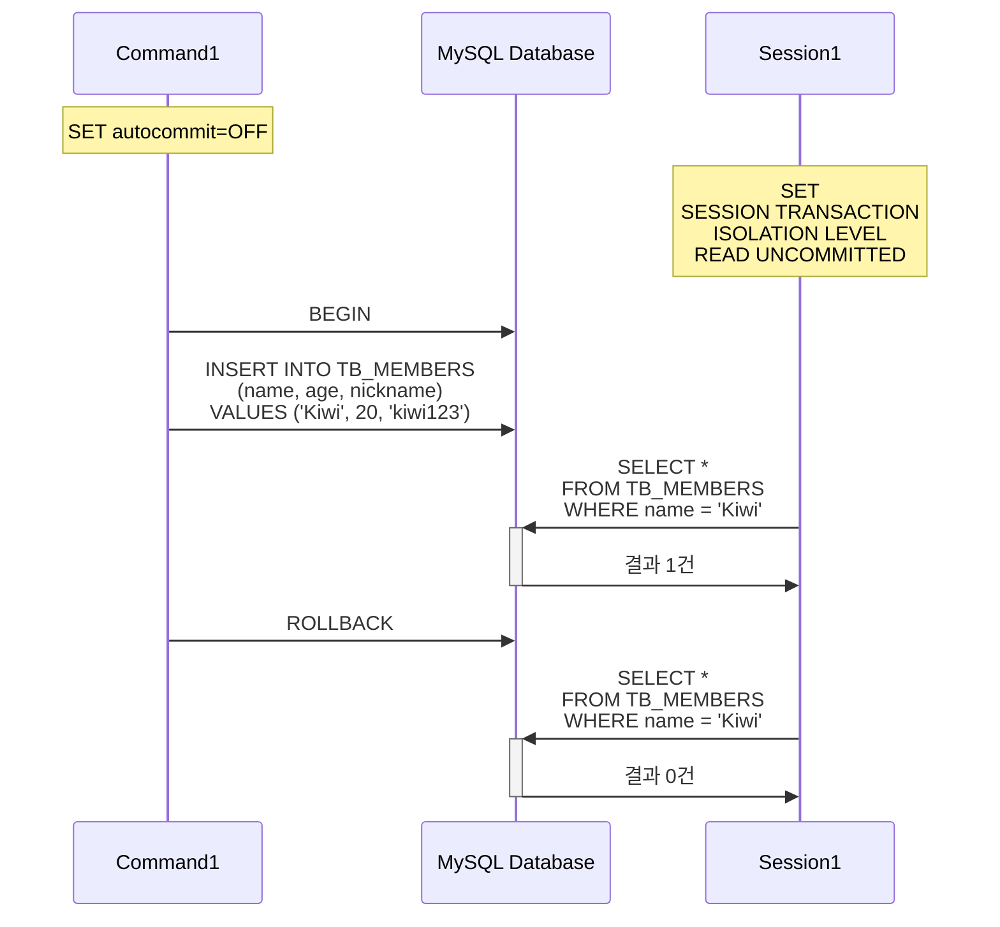
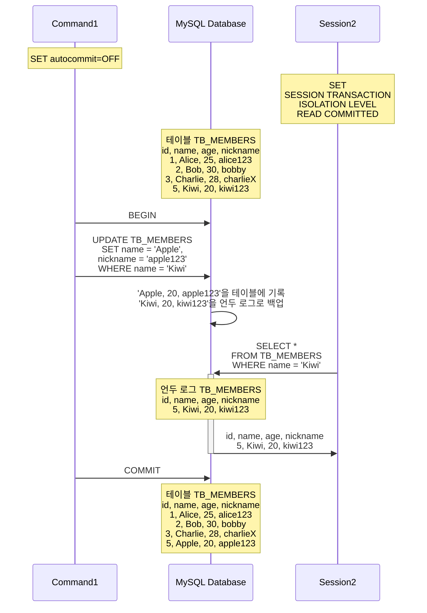
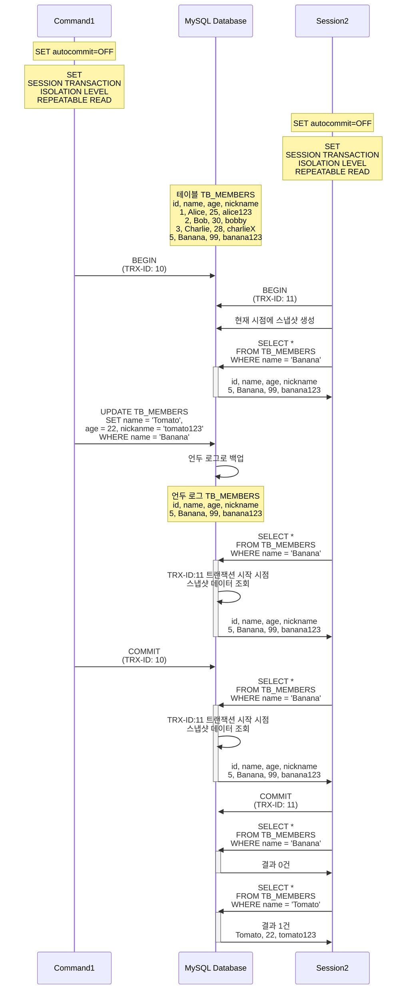
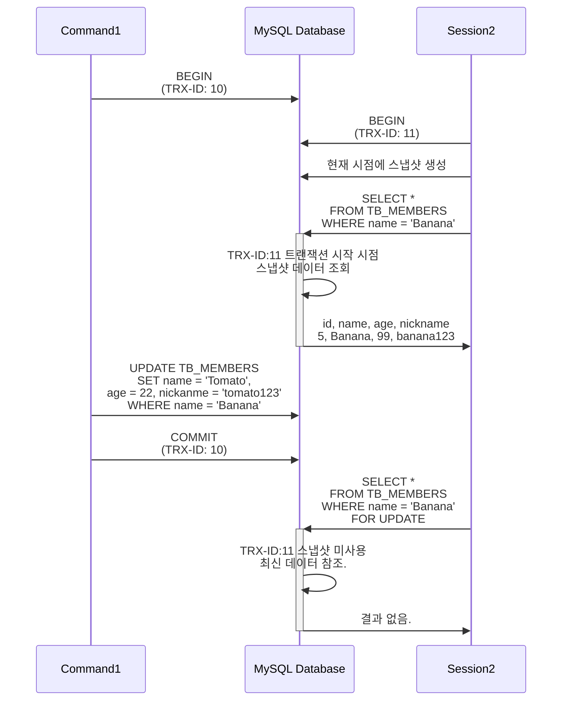
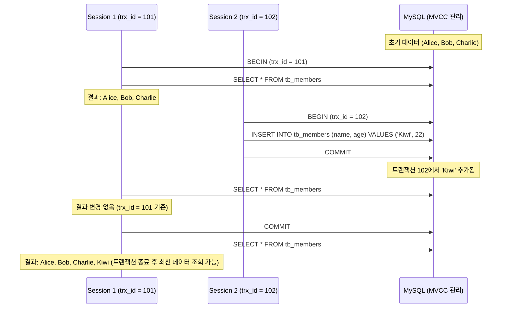

# 🎯 Transaction Isolation Level

# ✅ 시작에 앞서

트랜잭션 격리 수준을 테스트하기위한 테이블과 데이터 입니다.

- DDL

```sql
CREATE TABLE TB_MEMBERS (
    id        INT AUTO_INCREMENT PRIMARY KEY,
    name      VARCHAR(50) NOT NULL,
    age       INT NOT NULL,
    nickname  VARCHAR(30) UNIQUE
) ENGINE=InnoDB;
```

- DML

```sql
INSERT INTO TB_MEMBERS (name, age, nickname) VALUES
('Alice', 25, 'alice123'),
('Bob', 30, 'bobby'),
('Charlie', 28, 'charlieX');
```

데이터를 조작하는(`INSERT..`, `UPDATE..`) 세션과 조회하는 세션을 따루 두어 격리 수준에 따라 어떤 결과를 얻는지 확인합니다.  
각각의 격리 수준을 가지고 있는 `Session1,2`는 조회를 담당하며 `Command1,2`는 데이터 조작을 담당합니다.  
시퀀스 다이어그램에서 각 세션의 격리 수준을 확인하세요.  

```shell
# 격리 수준: READ UNCOMMITTED
mysql> SET SESSION TRANSACTION ISOLATION LEVEL READ UNCOMMITTED;

# 격리 수준: READ COMMITTED
mysql> SET SESSION TRANSACTION ISOLATION LEVEL READ COMMITTED;

# 격리 수준: REPEATABLE READ
mysql> SET SESSION TRANSACTION ISOLATION LEVEL REPEATABLE READ;

# 격리 수준: SERIALIZABLE
mysql> SET SESSION TRANSACTION ISOLATION LEVEL SERIALIZABLE;
```

현재 세션의 격리 수준을 조회하는 쿼리입니다.

```shell
mysql> SELECT @@session.transaction_isolation;
+---------------------------------+
| @@session.transaction_isolation |
+---------------------------------+
| REPEATABLE-READ                 |
+---------------------------------+
```

격리 수준의 레벨에 따라 발생하는 부정합 문제는 다음과 같습니다.

`⭕`: 발생, `❌`: 없음

|                  |             특징             | DIRTY READ | NON-REPEATABLE READ |   PHANTOM READ    |
|------------------|:--------------------------:|:----------:|:-------------------:|:-----------------:|
| READ UNCOMMITTED |     커밋되지 않은 데이터 읽기 가능      |     ⭕      |          ⭕          |         ⭕         |
| READ COMMITTED   |       커밋된 데이터만 읽기 가능       |     ❌      |          ⭕          |         ⭕         |
| REPEATABLE READ  | 같은 트랜잭션 내에서 같은 `SELECT` 보장 |     ❌      |          ❌          | ⭕<br/>(InnoDB는 ❌) |
| SERIALIZABLE     |  모든 `SELECT`에도 `LOCK` 적용   |     ❌      |          ❌          |         ❌         |

# 🎯 READ UNCOMMITTED

`READ UNCOMMITTED`에서 발생하는 부정합의 문제는 `DIRTY READ`가 있다.  
`COMMIT` 여부와 상관없이 다른 트랜잭션에서 보인다는 문제가 있는데 어떤 영향을 미치는지 아래의 그림으로 확인할 수 있다.



`Command1` 세션은 새로운 멤버로 `Kiwi` 를 추가하는 쿼리를 날리고 아직 `ROLLBACK` 하지 않은 상태에서  
`Session1(READ UNCOMMITED)`이 조회를 한 경우이다. 이때 `COMMIT` 여부와 상관없이 `Kiwi`가 조회되는 문제를 `DIRTY READ`라 한다.  
`READ UNCOMMITTED` 외의 다른 격리 수준에서는 보이지 않으며 정합성에 문제가 많은 격리 수준으로 권고 되지 않는다.

# 🎯 READ COMMITTED

`READ COMMITTED`는 오라클 DBMS에서 기본으로 사용되는 격리 수준이며 온라인 서비스에서 가장 많이 사용된다.  
`DIRTY READ`가 발생하지 않으며 어떤 트랜잭션이 데이터를 변경했더라도 `COMMIT`이 완료된 데이터만 다른 트랜잭션에서 조회할 수 있다.  

위의 결과를 확인하기 위해 `TB_MEMBERS`에 신규로 추가된 `Kiwi`를 `Apple`로 변경하는 쿼리를 날리고 `COMMIT`하기 전에 조회를 한다면 어떤 경우가 발생하는지 살펴보자.



`COMMAND1` 세션이 `Kiwi`의 이름과 닉네임을 변경하는 `UPDATE..` 쿼리를 실행하고 `COMMIT`하기 전에 `Session2`에서 조회하는 과정이다.  
아직 `COMMIT` 되지 않은 쿼리에서는 새로운 값인 `Apple, apple123`은 `TB_MEMBERS`에 즉시 기록되고  
이전 값인 `Kiwi, kiwi123`은 언두 영역으로 백업된다. `Session2`가 조회하는 순간은 격리 수준인 `READ COMIITED`에 따라 언두 로그에서 결과를 가져온다.  

최종적으로 `Command1`이 `COMMIT`을 하면 이후 조회부터는 `Apple, apple123`을 조회할 수 있다.  
이 부정합 문제를 `NON-REPEATABLE READ`라 하며 항상 같은 결과를 가져와야 한다는 `REPEATABLE READ` 정합성에 어긋나는 것이다.  

하나의 트랜잭션에서 동일한 데이터를 여러 번 읽고 변경하는 작업이 중요한 금전적인 처리와 연결되면 심각한 버그가 발생할 수 있다.  
예를 들어 하나의 트랜잭션에서 입금과 출금 처리가 여러번 진행될 때 다른 트랜잭션에서 오늘 입금된 금액의 총합을 조회한다면  
`NON-REPEATABLE READ`의 부정합 문제가 실감날 것이다.  


# 🎯 REPEATABLE READ

MySQL의 InnoDB 스토리지 엔진에서 기본으로 사용되는 격리 수준이며, `DIRTY READ`와 `NON-REPEATABLE READ` 문제가 발생하지 않는다.  
InnoDB 스토리지 엔진에서는 트랜잭션이 `ROLLBACK`될 가능성에 대비해 변경되기 전 레코드를 언두 공간에 백업해두고 실제 레코드 값을 변경한다.  
이러한 변경 방식을 `MVCC(Multi Version Concurrency Control)`이라 하며  
`REPEATABLE READ`는 이 `MVCC`를 위해 언두 영역에 백업된 이전 데이터를 이용해 동일 트랜잭션 내에서는 동일한 결과를 보여줄 수 있게 보장한다.  

`READ UNCOMMITED`도 `MVCC`를 이용해 `COMMIT` 되기 전에 데이터를 보여주지만  
언두 영역에 백업된 레코드의 여러 버전 가운데 몇 번째 이전 버전까지 찾아 들어가야 하느냐에 있다. 

2개의 세션을 `REPEATABLE READ` 격리 수준으로 시작한 다음 `COMMIT` 하기 전과 후에 결과가 어떻게 달라지는지 살펴보자.  



시퀀스 다이어그램을 요약하면 다음과 같다.  

1. `Command1`➡️ `BEGIN` 트랜잭션을 시작하고 `TRX-ID: 10`을 부여받음.
2. `Session2`➡️ `BEGIN` 트랜잭션을 시작하고 `TRX-ID: 11`을 부여받음. (스냅샷 생성)
3. `Session2`➡️ `SELECT..`를 통해 `Banana`를 조회할 수 있다.
4. `Command1`➡️ `UPDATE..`를 통해 `Banana`를 `Tomato`로 업데이트하는 쿼리 발생
5. `Session2`➡️ `SELECT..`를 통해 여전히 `Banana` 를 조회할 수 있다. (스냅샷을 통해 가능하다.)
6. `Command1`➡️ `COMMIT`으로 트랜잭션 종료 (`TRX-ID: 10`)
7. `Session2`➡️ `SELECT..`를 통해 여전히 `Banana` 를 조회할 수 있다. (스냅샷을 통해 가능하다.)
8. `Session2`➡️ `COMMIT`으로 트랜잭션 종료 (`TRX-ID: 11`)
9. `Session2`➡️ `SELECT..`를 통해 `Banana` 조회 불가능.
10. `Session2`➡️ `SELECT..`를 통해 `Tomato` 조회 가능.

이처럼 트랜잭션이 시작되면 해당 트랜잭션은 스냅샷을 유지하므로 다른 트랜잭션에서 변경한 내용은 보이지 않는다.  
트랜잭션 종료 후에는 신규로 추가된 `Tomato`를 조회할 수 있는데, 만약 락을 동반하는 읽기 같은 경우에는  
스냅샷이 아닌 최신 커밋된 데이터를 참조하므로 PHANTOM READ 현상이 나타날 수 있다.  

아래의 요약된 시퀀스 다이어그램을 살펴보자.  



1. `Command1`➡️ `BEGIN` 트랜잭션을 시작하고 `TRX-ID: 10`을 부여받음.
2. `Session2`➡️ `BEGIN` 트랜잭션을 시작하고 `TRX-ID: 11`을 부여받음. (스냅샷 생성)
3. `Session2`➡️ `SELECT..`를 통해 `Banana`를 조회할 수 있다.
4. `Command1`➡️ `UPDATE..`를 통해 `Banana`를 `Tomato`로 업데이트하는 쿼리 발생
5. `Command1`➡️ `COMMIT`으로 트랜잭션 종료 (`TRX-ID: 10`)
6. `Session2`➡️ `SELECT.. FOR UPDATE`를 통해 `Banana`를 조회할 수 없다.(최신 데이터 참조)

현재 커밋된 최신 데이터를 대상으로 락을 걸고 결과를 반환하기 때문에 `SELECT.. FOR UPDATE` 외에도  
`SELECT.. LOCK IN SHARE MODE`로 락을 획득하는 경우에도 최신 데이터를 참조한다.

# 🎯 SERIALIZABLE

