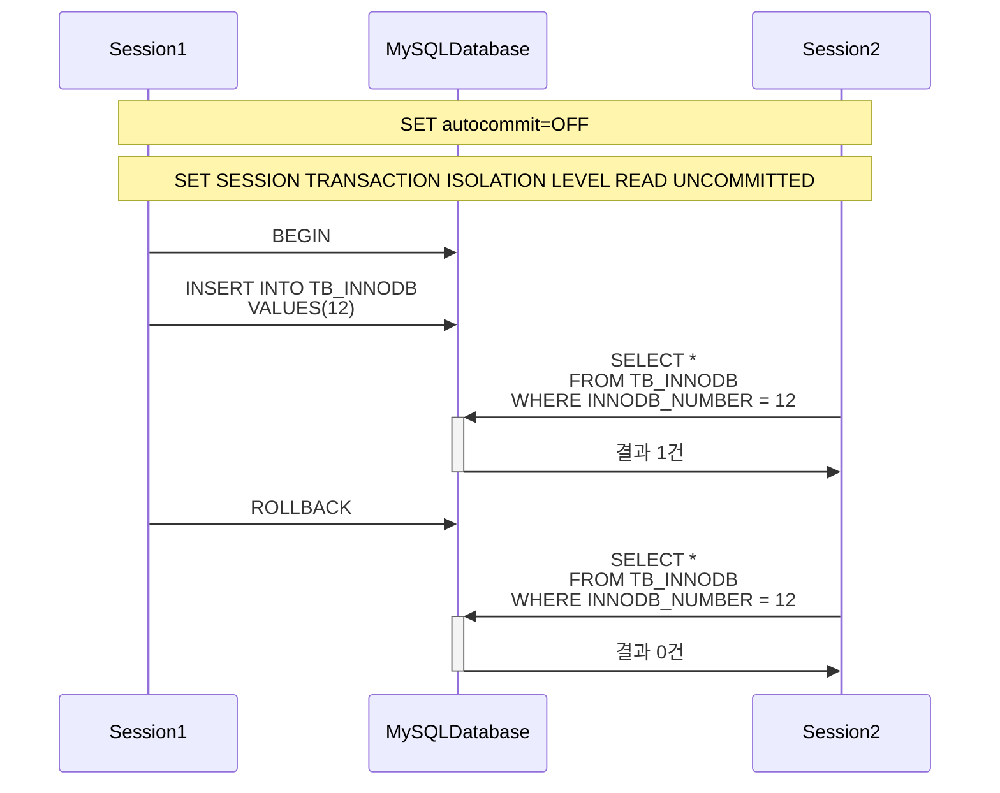
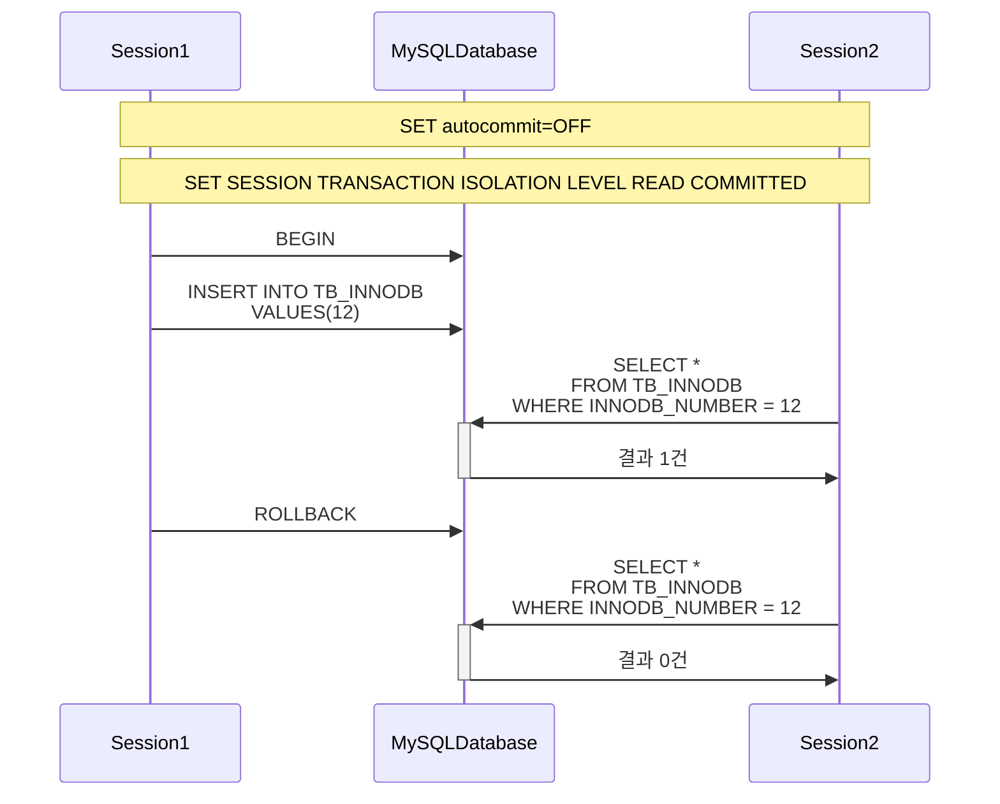

# 🎯 Transaction Isolation Level

# ✅ 시작에 앞서

트랜잭션 격리 수준을 테스트하기위한 테이블과 데이터 입니다.

- DDL

```sql
CREATE TABLE TB_MEMBERS (
    id        INT AUTO_INCREMENT PRIMARY KEY,
    name      VARCHAR(50) NOT NULL,
    age       INT NOT NULL,
    nickname  VARCHAR(30) UNIQUE
) ENGINE=InnoDB;
```

- DML

```sql
INSERT INTO TB_MEMBERS (name, age, nickname) VALUES
('Alice', 25, 'alice123'),
('Bob', 30, 'bobby'),
('Charlie', 28, 'charlieX');
```

# 🎯 READ UNCOMMITTED



# 🎯 READ COMMITTED



# 🎯 REPEATABLE READ


# 🎯 SERIALIZABLE

